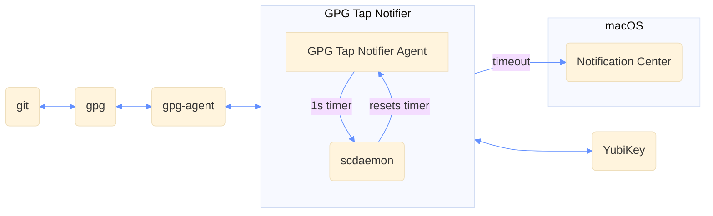

```mermaid
%%{ init: { 'theme': 'base', 'themeVariables': { 'lineColor': '#6390ff' } } }%%
flowchart LR
    subgraph macOS
    direction LR
    G(Notification Center)
    end

    subgraph GpgTapNotifier["GPG Tap Notifier"]
    direction TB
    F["GPG Tap Notifier Agent"]
    D(scdaemon)
    end

    B(gpg)
    C(gpg-agent)

    A(git) <--> B(gpg) <--> C(gpg-agent)
    C(gpg-agent) <--> GpgTapNotifier

    F["GPG Tap Notifier Agent"]-- 1s timer-->D(scdaemon)
    D(scdaemon)-- resets timer-->F["GPG Tap Notifier Agent"]

    GpgTapNotifier <--> E(YubiKey)
    GpgTapNotifier -- timeout --> G(Notification Center)

```
