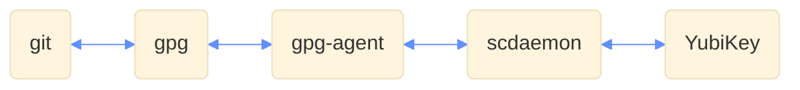

```mermaid
%%{ init: { 'theme': 'base', 'themeVariables': { 'lineColor': '#6390ff' } } }%%
flowchart LR
    B(gpg)
    C(gpg-agent)
    A(git) <--> B(gpg) <--> C(gpg-agent)
    C(gpg-agent) <--> D(scdaemon) <--> E(YubiKey)
```
