# GPG Tap Notifier (for macOS)

GPG Tap Notifier is a Swift rewrite of [`klali/scdaemon-proxy`](https://github.com/klali/scdaemon-proxy) for macOS.

## What does it do?

This app provides reminders to touch your security devices (e.g. YubiKeys) on macOS through a native notification.


## How does it work?

The `gpg-agent` and `scdaemon` tools currently lack a builtin mechanism to alert external processes when it's waiting for human input to a smartcard.

Using a YubiKey as an example of a smartcard, a `git commit` triggers the following sequence of communication.


This tool takes the `scdaemon` portion and wraps its communication with `gpg-agent`. Specifically, `gpg-agent` is configured to execute the `GpgTapNotifierAgent` binary, which in turn executes `scdaemon`. Messages from `gpg-agent` are forwarded to `scdaemon`, and any 1 second delay from `scdaemon`'s responses is assumed to be due to a user input requirement.



Communication between `scdaemon` and the smartcard (YubiKey) happen as normal.

This technique was demonstrated to work reliably at [`klali/scdaemon-proxy`](https://github.com/klali/scdaemon-proxy). The tool here simply re-implements the logic in Swift and adds a configurational user interface to make setup easier. This version of the tool would not exist without the original. As such, we've retained licence copyrights to credit it where appropriate.

## FAQ

### I'm seeing "signing failed: No SmartCard daemon" errors

If you see the following error:

```
gpg: signing failed: No SmartCard daemon
gpg: [stdin]: clear-sign failed: No SmartCard daemon
```

It's likely the `GPG Tap Notifier.app` was moved after it was configured. This causes `~/.gnupg/gpg-agent.conf` to refer to a value of `scdaemon-program` that no longer exists on the file system. Opening `GPG Tap Notifier.app` and setting it back to _Enabled_ it should fix this problem.

### Does this work for Web Browsers?

It does not. YubiKeys support different _interfaces_ and WebAuthn is a different interface than the _OpenPGP_ interface. Fortunately this tool isn't necessary for WebAuthn since most web browsers will tell you it's waiting on input from a security key. (As opposed to `git` and `gpg`, which provide no indicators.)
